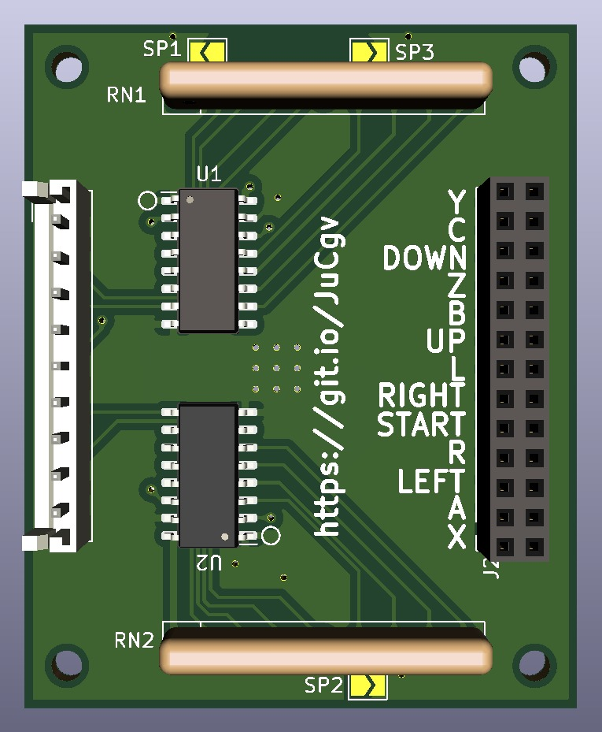

# SEGA Saturn Controller circuit

* Schematics originally drawn by Andre Biagioni based on inspection of an actual original controller and other sources of info found online (see thread at https://forum.fiozera.com.br/t/esquematico-de-controle-para-sega-saturn/111 - in Brazilian Portuguese)
* KICAD project drawn by Lucas de Souza (https://github.com/setryky)

This project is licensed under the MIT license.
